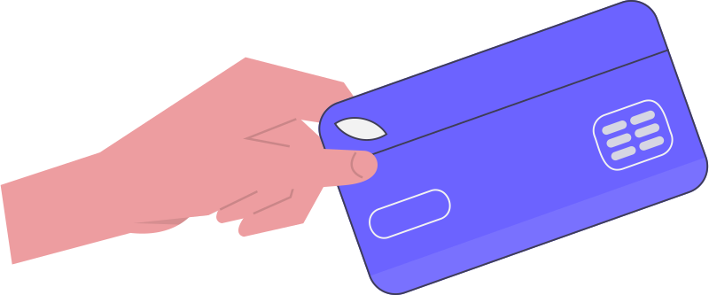

# Analyzing Credit Card Transactions

Credit card transactions are one of the most valuable — and most sensitive — data assets a financial institution owns. They power fraud detection, customer segmentation, lifetime-value modeling, merchant analytics, and personalised offers. Yet *publicly available* card data is scarce: real transactions cannot be released for privacy reasons, and the synthetic datasets that exist are usually small, heavily anonymised, or both.

For example, the well-known [Kaggle Credit Card Fraud dataset](https://www.kaggle.com/datasets/mlg-ulb/creditcardfraud) contains only 284,807 transactions over two days, of which fewer than 500 are fraudulent. Worse, all but two of its columns are the result of a principal-components transformation, which obfuscates the underlying business meaning.

This case study uses a much larger, more realistic synthetic dataset published by IBM. It contains over **20 million transactions** generated from a multi-agent simulation of consumer behaviour, with no obfuscation of the columns.



&nbsp;

- **Dataset:** [Kaggle — Credit Card Transactions](https://www.kaggle.com/datasets/ealtman2019/credit-card-transactions)
- **How the data was generated:** [Synthesizing Credit Card Transactions (Altman, 2019)](https://arxiv.org/abs/1910.03033)

## Learning objectives

By the end of this chapter you should be able to:

1. Explain why retailers, banks, and analytics teams treat card transaction data as a strategic asset.
2. Load a multi-gigabyte CSV / Parquet file efficiently using **Polars** and **DuckDB**.
3. Clean common dirty-data patterns (currency strings, missing zip codes, split date columns).
4. Engineer features such as rolling spend, time since last transaction, and category flags.
5. Use SQL window functions and Polars expressions interchangeably for aggregations.
6. Recognise the limitations of synthetic data and what they imply for a real fraud-detection model.

## About the dataset

The data is provided as a single CSV (and a derived Parquet) whose schema is described in the first row. It covers:

- **2,000 synthetic consumers** based in the United States who travel internationally.
- **Decades of purchases**, including multiple cards per customer.
- A mix of **chip, swipe, and online** transactions.
- A small, realistic fraction of **fraudulent transactions** labeled with `Is Fraud?`.

```{list-table} Notable columns
:header-rows: 1

* - Column
  - Description
  - Notes
* - `User`
  - Synthetic customer id
  - Use to partition rolling/window features.
* - `Card`
  - Card index for that user
  - A user may hold multiple cards.
* - `Year`, `Month`, `Day`, `Time`
  - Transaction timestamp split across columns
  - Combine into a single `Datetime` column.
* - `Amount`
  - Transaction amount as a string (e.g. `"$54.32"`)
  - Strip the `$` and cast to `float64`. Negative values are refunds.
* - `Use Chip`
  - `Chip Transaction`, `Swipe Transaction`, `Online Transaction`
  - Useful for fraud heuristics.
* - `Merchant Name`, `Merchant City`, `Merchant State`, `Zip`, `MCC`
  - Merchant attributes
  - `MCC` (Merchant Category Code) is a standard 4-digit retail category.
* - `Is Fraud?`
  - `"Yes"` / `"No"` label
  - Highly imbalanced — fewer than 0.2% positive in most months.
```

:::{important} Why we use Polars *and* DuckDB
The chapter teaches both libraries because they complement each other:

- **Polars** is a Rust-based DataFrame library with a fluent expression API. It excels at transformations and pipeline-style code, and is the natural successor to pandas for medium-to-large data.
- **DuckDB** is an in-process analytical SQL engine. It is the right choice when your team thinks in SQL, when you want to read Parquet directly, or when you need window functions over hundreds of millions of rows on a laptop.

Most analytics teams end up using both. Knowing the same operation in each language makes it much easier to choose the right tool for the next problem.
:::

## How this chapter is organised

```{list-table}
:header-rows: 1

* - Notebook
  - Goal
* - **Introduction to Polars**
  - Learn the Polars DataFrame API, expressions, and lazy evaluation.
* - **Analyze Credit Card Transactions with Polars**
  - End-to-end preprocessing and feature engineering on the IBM dataset using Polars.
* - **Introduction to DuckDB**
  - Learn how DuckDB queries Parquet, CSV, and pandas DataFrames directly.
* - **Analyze Credit Card Transactions with DuckDB**
  - Replicate the same preprocessing and feature engineering using SQL.
```

:::{tip} Recommended order
If you are new to both libraries, work through the **Polars** track first (it is closer to pandas and easier to debug), then redo the analysis in **DuckDB** to see the same operations expressed in SQL.
:::

## Tasks (the analytical workflow)

The notebooks build up the following workflow step by step:

1. Read the CSV (or Parquet) file and inspect the schema and dtypes.
2. Parse `"Amount"` from a `$`-prefixed string into `float64`.
3. Combine the `Year`, `Month`, `Day`, and `Time` columns into a single `Datetime`.
4. Look at the distributions of categorical columns such as `"Use Chip"` and `"Is Fraud?"`.
5. Create boolean flag columns to mark suspicious transactions (e.g. *online + foreign + above-average amount*).
6. Filter for online refunds (online transactions whose amount is negative).
7. Aggregate per user: total spend, average ticket size, and number of transactions.
8. Use a rolling/window feature (per user) to mimic SQL's `OVER (PARTITION BY user ORDER BY datetime)` behaviour and capture spending trends.
9. Compare the same operation expressed in Polars and in DuckDB SQL.

:::{caution} Real-world fraud detection is more than feature engineering
The features built in this chapter are useful inputs to a fraud model, but a production fraud system also requires:

- Sub-second scoring latency
- Continuous re-training on labeled feedback
- Calibrated probabilities so a risk team can set policy thresholds
- Rigorous monitoring for **concept drift** (fraudster behaviour changes constantly)

Treat the work in this chapter as the **data layer** that any of those systems would sit on top of.
:::

:::{seealso} Further reading
- IBM Research — [Synthesizing Credit Card Transactions](https://arxiv.org/abs/1910.03033)
- Polars — [User Guide](https://docs.pola.rs/)
- DuckDB — [Documentation](https://duckdb.org/docs/)
- Visa Risk — [Public materials on real-time fraud scoring](https://usa.visa.com/about-visa/visa-fraud-detection.html)
:::

[^1]: [Kaggle — Credit Card Transactions Dataset](https://www.kaggle.com/datasets/ealtman2019/credit-card-transactions/)
